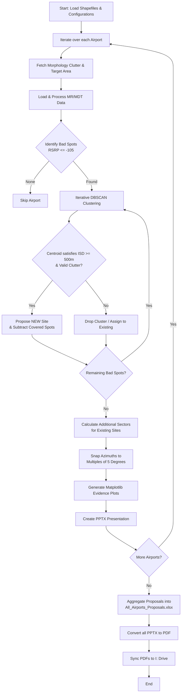

# RSRP Improvement Automated Pipeline

An automated geospatial pipeline designed to propose new cell sites and additional sectors to improve RSRP (Reference Signal Received Power) coverage around Indonesian airports.

## 📌 Project Overview
This tool performs iterative clustering and geospatial analysis on historical Measurement Report (MR) and Minimization of Drive Tests (MDT) data. By identifying "Bad Spots" (locations with RSRP <= -105 dBm), the algorithm intelligently recommends precise coordinates and optimal azimuth angles for new cell sites and extra sectors.

## 🛠️ Technology Stack
- **Geospatial Processing:** Geopandas, Shapely, Pyproj, Fiona, Shapefile
- **Clustering & Analytics:** Scikit-Learn (DBSCAN), Pandas, Numpy
- **Data Visualization:** Matplotlib, Contextily
- **Reporting:** python-pptx (PowerPoint), openpyxl (Excel), comtypes (PDF Conversion)

## 🧠 Core Logic & Algorithm

1. **Data Ingestion:**
   - Loads the territory bounds, airport shapefiles, and historical network cell site parameters.
   - Extracts localized MR and MDT coverage data for both `Combine` and `Indoor` conditions.
2. **Bad Spot Detection:**
   - Filters geospatial points matching poor coverage criteria (`RSRP <= -105 dBm`).
3. **Iterative DBSCAN Clustering:**
   - Clusters the bad spots. Centroids of these clusters are evaluated as candidates for **New Sites**.
   - **Constraints applied:**
     - Must be at least 500m away from existing sites and other proposed sites (ISD constraint).
     - Must fall strictly inside valid morphology/clutter boundaries.
   - For valid centroids, dynamic coverage radii are applied based on the underlying morphology (e.g., `DENSE URBAN: 400m`, `SUB URBAN: 1000m`, etc.).
   - Bad spots falling inside these new radii are removed from the queue.
4. **Additional Sector Allocation:**
   - Remaining bad spots that couldn't justify a new site are evaluated against existing nearby sites.
   - Optimal azimuth angles (locked to increments of 5 degrees) are calculated to direct new sectors exactly where needed.
5. **Output Generation:**
   - **Combined Excel Report:** Aggregates all proposed configurations.
   - **Geospatial Plots:** Generates before/after coverage comparison maps.
   - **Presentations (PDF):** Assembles plots into PowerPoint decks and seamlessly exports them as PDFs synced to Google Drive.

## 📊 Pipeline Flowchart

